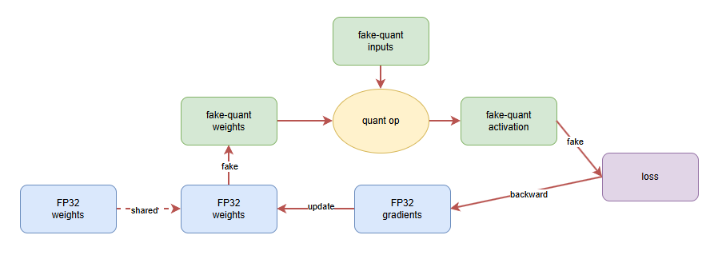
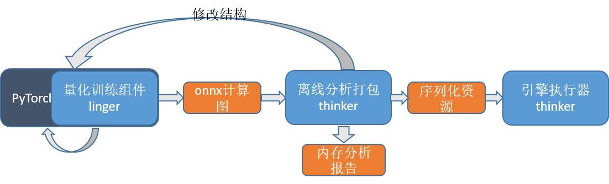

--------------------------------------------------------------------------------
#### [English](README_en.md) | 简体中文  
 
[](https://pypi.org/project/pylinger)
[](https://pypi.org/project/pylinger/)
[](https://github.com/LISTENAI/linger/blob/main/LICENSE)
[](https://github.com/LISTENAI/linger/actions/workflows/auto_test.yml)

linger是由聆思科技开源的的神经网络量化训练组件，是聆思科技开源的AI生态工具链LNN(ListenAI Neural Network)的一部分，结合另一个聆思开源的推理引擎框架[thinker](https://github.com/LISTENAI/thinker)可实现产业级深度学习训练推理一体化平台，集深度学习量化训练和引擎推理、LUNA器件库和丰富的辅助组件于一体。LNN是专为聆思AIOT芯片（目前只支持CSK60xx系列）定制开发，助力开发者轻松在聆思VENUS芯片上快速上线AI业务，帮助越来越多嵌入式尤其是AIOT产品实现AI赋能，助力产业智能化升级。目前LNN工具链已支持聆思芯片在计算机视觉、语音唤醒、语音识别、离线翻译等10多个AI应用场景中的产品落地。

## 方案简介
linger基于PyTorch对聆思LUNA系列芯片进行深度定制，在神经网络训练的前向过程中将激活和权重量化到8bit，通过参数调整得到量化无损的8bit模型



## 技术亮点
### 1. 易用性高
linger 是基于 PyTorch 的量化方案，在原始浮点训练代码中加入一行 linger 相关代码即可完成进行量化算子的替换，使用原始的训练流程即可完成量化训练，无需其他复杂设置

### 2. 拓展性好
linger 基于 PyTorch 进行量化算子的搭建，因此只要符合 PyTorch 拓展算子的规范，你可以添加任何量化算子到 linger 中来完成你的量化需求

### 3. 工具链完整
linger 后端适配 [thinker](https://github.com/LISTENAI/thinker) 推理引擎，thinker 推理引擎为CSK60XX而生，功能完善，量化训练与推理过程可无缝衔接，同时训练推理二进制一致得到保证


## 快速入门
- [安装](doc/tutorial/install.md)：支持pip、源码、docker三种安装方式
- [浮点-定点两阶段量化训练](doc/tutorial/get_started_for_two_stage.md): 先进行浮点网络的约束训练，再针对量化友好的浮点模型进行量化训练微调
- [浮点-定点两阶段量化训练方案详解](doc/tutorial/two_stage_quant_aware_train.md)
- [onnx导出教程](doc/tutorial/from_mode_to_onnx.md)：将量化无损的PyTorch模型导出为ONNX格式的模型
- [权重分析工具使用及量化onnx导出错误调试](doc/tutorial/wb_analyse_tool_and_onnx_export_debug_tool.md)

## 工程示例
AI算法落地基本涵盖六个阶段：模型规约性检查、浮点训练、量化训练、模型打包、模拟引擎执行、固件烧录并芯片运行。其中固件烧录并芯片运行需要在聆思的开发板上来完成，如有需要请与我们联系，这里不做进一步介绍。其它五个阶段的流程示例图如下：  
  
其中模型规约性检查的功能是穿插在量化训练和模型打包中来完成的。 
我们先假设模型结构与底层硬件完全适配，介绍流程中各个阶段，再介绍模型规约性检查的具体实现（实际开发过程中规约性检查要在模型结构初步进行，避免后续工作返工）。
### 1. 浮点训练
  我们基于[pytorch-cifar100](https://github.com/weiaicunzai/pytorch-cifar100)来进行功能展示  
  首先确保在当前环境下（建议linger-env)，浮点模型训练基于pytorch能够跑起来。 
```Shell
python train.py -net resnet50 -gpu
```
  建议采用两阶段量化训练，对浮点训练的数据进行范围约束，只需[添加少量代码](https://github.com/LISTENAI/thinker/blob/main/thinker/docs/tutorial/resnet_modify1.md).  
  为避免冲突，将tesnorboard[功能关闭](https://github.com/LISTENAI/thinker/blob/main/thinker/docs/tutorial/resnet_modify2.md)。同样的指令开启训练，运行几个epoch后，在checkpoint/resnet50文件夹中生成了一个**.pth文件

### 2. 量化训练和导出
  加载步1中保存的浮点模型**.pth，[修改约束代码](https://github.com/LISTENAI/thinker/blob/main/thinker/docs/images/linger_set2.png)，即可将浮点算子替换为量化算子。同样的指令开启量化训练，训练几个epoch后，同样在checkpoint/resnet50文件夹中生成了一个**.pth文件。
  使用linger的模型转换工具，将[模型转换成onnx计算图](https://github.com/LISTENAI/thinker/blob/main/thinker/docs/images/onnx_export.png)。

### 3. 模型分析和打包
  切换到thinker-env环境，使用thinker离线工具tpacker对步2生成的onnx计算图打包，这里我们以训练好的resnet18模型为例，进行打包
```Shell
tpacker -g demo/resnet18/resnet18-12-regular.onnx -d True -o demo/resnet18/model.bin
```
这里使用到的资源可以从[thinker/demo/resnet18](https://github.com/LISTENAI/thinker/tree/main/demo/resnet18)中获取

### 4. 推理执行
  使用调用示例工程test_thinker，指定输入数据、资源文件和输出文件名称即可运行模拟代码。  
```Shell
chmod +x ./bin/test_thinker
./bin/test_thinker demo/resnet18/input.bin demo/resnet18/model.bin demo/resnet18/output.bin 3 32 32 6
```
  注意：推理执行需要[安装thinker源码](https://github.com/LISTENAI/thinker/blob/main/thinker/docs/tutorial/install.md)，并完成编译。


### 5. 规约性检查
  该阶段不关注模型的效果，只关注模型的结构是否和底层硬件相适配，功能实现贯穿了1~4步
  * 在步1中，对模型参数进行初始化或者训练几个epoch即可将模型文件导出，无需模型收敛。
  * 步2中加载步1的模型文件，进行量化训练时，会对算子参数的合规性进行检查，如有不符合的设置，报错退出[错误示例](https://github.com/LISTENAI/thinker/blob/main/thinker/docs/images/resnet50_linger_err.png)。用户根据报错信息修改层参数并返回步1，直至通过步2。
  * 步3中加载步2的计算图，工具会对节点的tensor大小进行检查，[如果tensor大小超限会报错退出](https://github.com/LISTENAI/thinker/blob/main/thinker/docs/images/Resnet50_err.png)。否则进入内存分析阶段，会在根目录下生成[内存分析报告](https://github.com/LISTENAI/thinker/blob/main/thinker/docs/images/Resnet50_Mem1.png)，并提示整体的flash/psram/share-memory占用。对于超过硬件限制的报错，用户可结合报错信息和[内存分析报告](https://github.com/LISTENAI/thinker/blob/main/thinker/docs/images/Resnet50_Mem2.png)来定位计算图中的超限的算子，返回步1进行模型结构调整，直至[通过步3的打包流程](https://github.com/LISTENAI/thinker/blob/main/thinker/docs/images/Resnet50_sucess.png)。   
  至此完成模型规约性检查，确保了模型能够在芯片上能够跑起来。模型效率评估目前只支持在芯片上部署运行，具体需求可联系我们。

## 能力展示
- [linger API](doc/tutorial/linger_api.md)
- [支持量化OP列表](doc/tutorial/support_quant_ops.md)及[模型结构限制说明](https://github.com/LISTENAI/thinker/blob/main/thinker/docs/tutorial/restrain_of_model.md)

## 常见问题
- [安装出现问题解决](doc/tutorial/install_bugs.md)
- [量化常见问题与注意事项](doc/tutorial/quant_faq.md)

## 版本说明
- 请参考[RELEASE](doc/tutorial/release.md)

## 交流与反馈
- 欢迎您通过 Github Issues 来提交 BUG 与建议
- 技术交流微信群  


## 引用
- [PyTorch](https://github.com/pytorch/pytorch)
- [ONNX](https://github.com/onnx/onnx)
- [pytorch-cifar100](https://github.com/weiaicunzai/pytorch-cifar100)
- 
## 应用示例
* 鼾声检测[https://github.com/mywang44/snoring_net]
  
## 版权和许可证
- linger 由 [Apache-2.0 license](LICENSE) 提供
