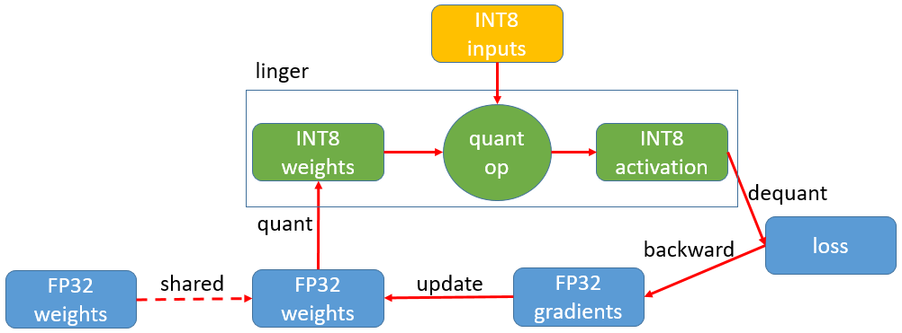

--------------------------------------------------------------------------------
#### [English](README_en.md) | 简体中文  

## 方案简介
linger基于PyTorch对聆思IOT系列芯片进行深度定制，在神经网络训练的前向过程中将激活和权重量化到8bit，通过参数调整得到量化无损的8bit模型

## 技术亮点
### 1. 易用性高
linger 是基于 PyTorch 的量化方案，在原始浮点训练代码中加入一行 linger 相关代码即可完成进行量化算子的替换，使用原始的训练流程即可完成量化训练，无需其他复杂设置

### 2. 拓展性好
linger 基于 PyTorch 进行量化算子的搭建，因此只要符合 PyTorch 拓展算子的规范，你可以添加任何量化算子到 linger 中来完成你的量化需求

## 快速入门
- [安装](doc/tutorial/install.md)：支持pip、源码、docker三种安装方式
- [量化训练快速入门](doc/tutorial/quant_quick_strat.md): 先进行浮点网络的约束训练，再针对量化友好的浮点模型进行量化训练微调
- [量化训练进阶指导](doc/tutorial/quant_advanced_guide.md): 量化进阶配置
- [onnx导出教程](doc/tutorial/export_onnx.md)：将量化无损的PyTorch模型导出为ONNX格式的模型

## 能力展示
- [linger API](doc/tutorial/linger_api.md)
- [支持量化OP列表](doc/tutorial/support_quant_ops.md)

## 常见问题
- [安装出现问题解决](doc/tutorial/install_errors.md)
- [量化常见问题与注意事项](doc/tutorial/quant_faq.md)

## 版本说明
- 请参考[RELEASE](doc/tutorial/release.md)

