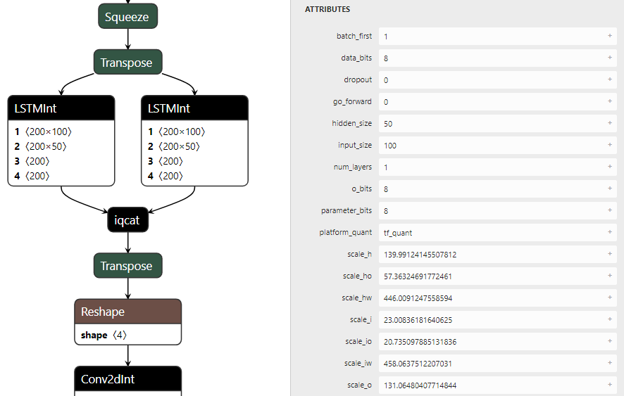
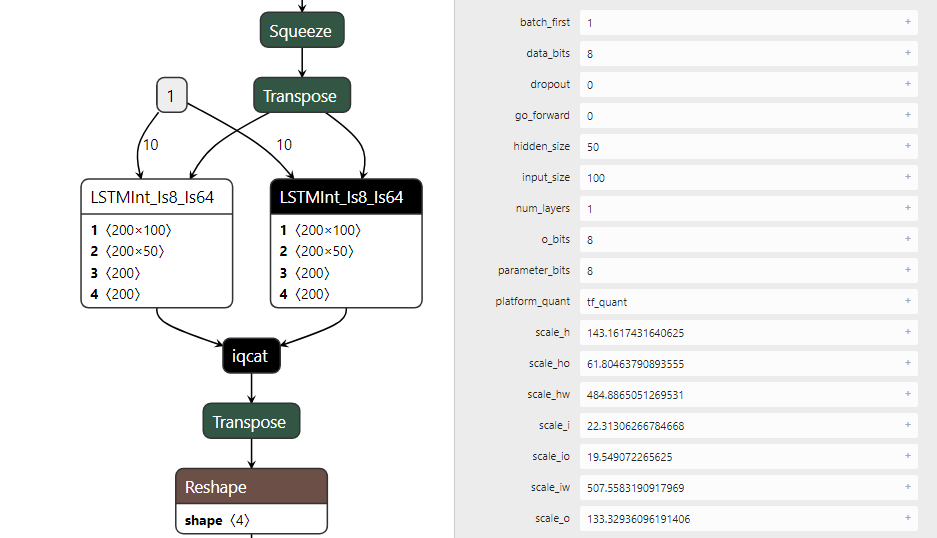
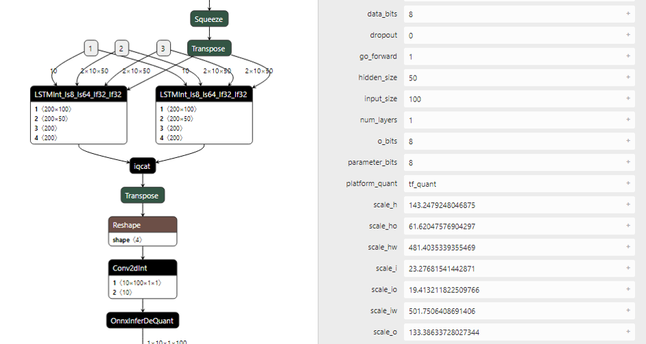
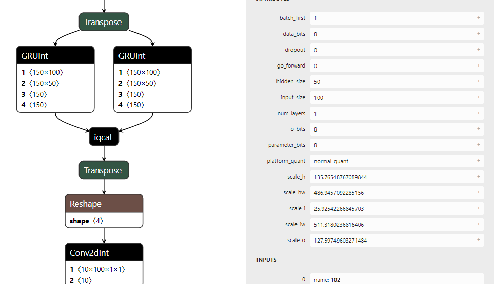
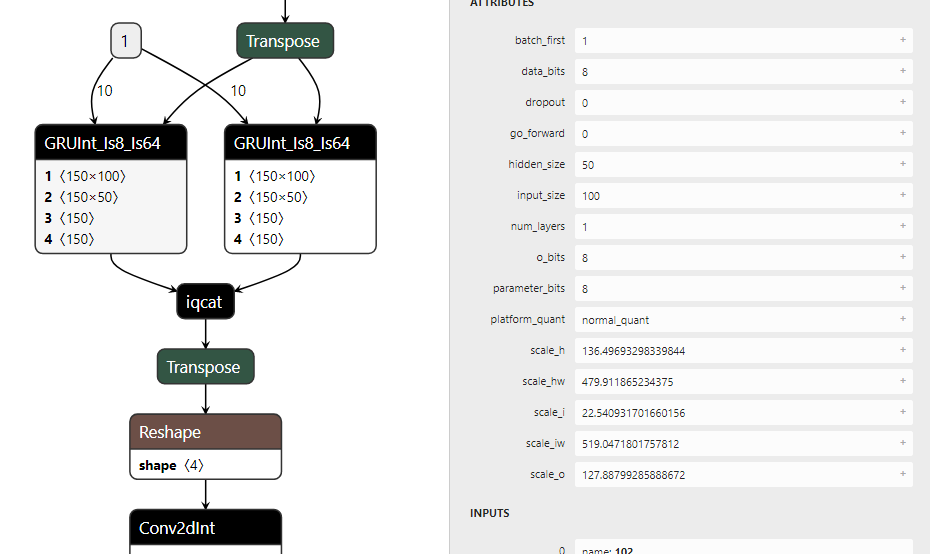
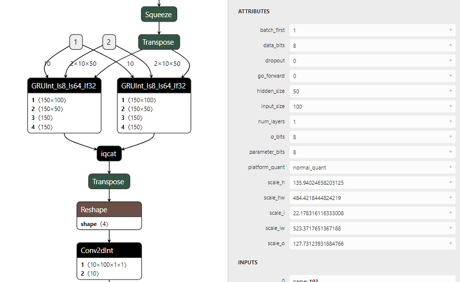
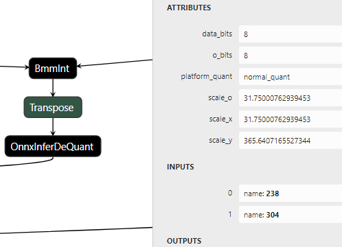

# 目前支持量化的op列表如下

| PyTorch(float32)   | linger算子名称                            | linger导出onnx算子名称                              | 支持关闭的设置                     |
| ------------------ | ----------------------------------------- | --------------------------------------------------- | ---------------------------------- |
| nn.BatchNorm2d     | [BatchNorm2dInt](#batchnorm2dint)         | BatchNorm2dInt                                      | -                                  |
| nn.LayerNorm2d     | [LayerNorm2dInt](#layernorm2dint)         | LayerNorm2dInt                                      | -                                  |
| nn.Linear          | [LinearInt](#linearint)                   | LinearInt                                           | -                                  |
| nn.Conv1d          | [Conv1dInt](#conv1dint)                   | Conv1dInt                                           | -                                  |
| nn.Conv2d          | [Conv2dInt](#conv2dint)                   | Conv2dInt                                           | -                                  |
| nn.ConvTranspose2d | [ConvTranspose2dInt](#convtranspose2dint) | ConvTranspose2dInt                                  | -                                  |
| nn.AvgPool2d       | [AvgPool2dInt](#avgpool2dint)             | AvgPool2dInt                                        | -                                  |
| nn.MaxPool2d       | [iqMaxPool2d](#iqMaxPool2d)               | MaxPool2d                                           | -                                  |
| nn.GRU             | [GRUInt](#gruint)                         | GRUInt/GRUInt_Is8_Is64/GRUInt_Is8_Is64_If32         | -                                  |
| nn.LSTM            | [LSTMInt](#lstmint)                       | LSTMInt/LSTMInt_Is8_Is64/LSTMInt_Is8_Is64_If32_If32 | -                                  |
| nn.Relu            | [iqRelu](#relu)                           | Relu                                                | -                                  |
| nn.RELU6           | [ReLU6Int](#reLU6Int)                     | Clip                                                | -                                  |
| torch.bmm          | [BmmInt](#bmmint)                         | BmmInt                                              | -                                  |
| torch.sigmoid      | [iqSigmoid](#iqsigmoid)                   | iqSigmoid                                           | `linger.SetIQTensorSigmoid(False)` |
| torch.tanh         | [iqTanh](#iqtanh)                         | iqTanh                                              | `linger.SetIQTensorTanh(False)`    |
| torch.clamp        | [iqClamp](#iqclamp)                       | iqClamp                                             | `linger.SetIQTensorClamp(False)`   |
| torch.cat          | [iqCat](#iqcat)                           | iqCat                                               | `linger.SetIQTensorCat(False)`     |
| torch.transpose    | [iqTranspose](#iqtranspose)               | Transpose                                           | -                                  |
| view               | [iqView](#iqview)                         | Reshape                                             | -                                  |
| reshape            | [iqReshape](#iqreshape)                   | Reshape                                             | -                                  |
| squeeze            | [iqSqueeze](#iqsqueeze)                   | Squeeze                                             | -                                  |
| unsqueeze          | [iqUnsqueeze](#iqunsqueeze)               | Unsqueeze                                           | -                                  |
| flatten            | [iqFlatten](#iqFlatten)                   | Flatten                                             | -                                  |
| split              | -                                         | -                                                   | -                                  |
| slice              | [slice](#slice)                           | Slice                                               | -                                  |
| sum                | [iqSum](#iqSum)                           | iqSum                                               | `linger.SetIQTensorSum(False)`     |
| add                | [iqAdd](#iqadd)                           | iqAdd                                               | `linger.SetIQTensorAdd(False)`     |
| sub                | -                                         | -                                                   | -                                  |
| mul                | [iqMul](#iqmul)                           | iqMul                                               | `linger.SetIQTensorMul(False)`     |
| div                | [iqDiv](#iqDiv)                           | iqDiv                                               | `linger.SetIQTensorDiv(False)`     |
| upsample           | -                                         | -                                                   | -                                  |
| nn.Embedding       | [EmbeddingInt](#EmbeddingInt)             | Gather                                              | -                                  |
| quant              | [quant](#quant)                           | Quant                                               | -                                  |
| dequant            | [dequant](#dequant)                       | Dequant                                             | -                                  |
| requant            | [Requant](#Requant)                       | Requant                                             | -                                  |
| layernorm          | [LayerNormInt](#LayerNormInt)             | LayerNormInt                                        | -                                  |
| softmax            | [SoftmaxInt](#SoftmaxInt)                 | SoftmaxInt                                          | -                                  |
| logsoftmax         | [LogSoftmaxInt](#LogSoftmaxInt)           | LogSoftmaxInt                                       | -                                  |
| flip               | [iqFlip](#iqFlip)                         | Slice                                               | -                                  |
| var                | [iqVar](#iqVar)                           | iqVar                                               | -                                  |
| -                  | [channel_shuffle](#channel_shuffle)       | ShuffleChannel                                      | `SetFunctionChannelShuffleQuant(False)`|

------------
# Operator 命名规则
`(MajorName)[_Inputs_Outputs]`
## MajorName 必需
Operator 主名字,名字内部不允许有符号,仅英文和数字。例如iqMul

--------------
# 术语说明
## 量化方式
在部分op的属性中有platform_quant属性，标识平台相关量化方法，说明如下:

- luna_quant: castor全量化方式(int8->int8)，针对castor硬件量化，浮点到定点round采用的(x+0.5).floor()计算

$$(\lfloor x\_int*\frac{scale\_z}{scale\_x}+0.5\rfloor+\lfloor y\_int*\frac{scale\_z}{scale\_y}+0.5\rfloor).int().clamp(-128,127)$$

## Scale说明
- scale_i: Input的scale, scale_x,scale_1,scale_2, scale_y同理, bits可以取8，16等

$$\frac{2^{bits-1}-1}{running\_i}$$

- scale_w: Weight的scale, scale_iw, scale_hw同理, bits可以取8，16等

$$\frac{2^{bits-1}-1}{weight.abs().max()}$$

- scale_o: Output的scale, bits可以取8，16等

$$\frac{2^{bits-1}-1}{running\_o}$$

  
## Mode参数值
- mode: 所有模式下的device信息

## onnx类型值

### 类型说明
| Group                  | Types                     | Description                                                                          |
| ---------------------- | ------------------------- | ------------------------------------------------------------------------------------ |
| Floating Point Types   | FLOAT16, FLOAT32, FLOAT64 | Values adhering to the IEEE 754-2008 standard representation of floating-point data. |
| Signed Integer Types   | INT8, INT16, INT32, INT64 | Signed integers are supported for 8-64 bit widths.                                   |
| Unsigned Integer Types | UINT8, UINT16             | Unsigned integers of 8 or 16 bits are supported.                                     |
| Complex Types          | COMPLEX64, COMPLEX128     | A complex number with either 32- or 64-bit real and imaginary parts.                 |
| Other                  | STRING                    | Strings represent textual data. All strings are encoded using UTF-8.                 |
| Other                  | BOOL                      | Boolean values represent data with only two values, typically true and false.        |

### 类型和值

| 类型       | 值  |
| ---------- | --- |
| UNDEFINED  | 0   |
| FLOAT32    | 1   |
| UINT8      | 2   |
| INT8       | 3   |
| UINT16     | 4   |
| INT16      | 5   |
| INT32      | 6   |
| INT64      | 7   |
| STR        | 8   |
| BOOL       | 9   |
| FLOAT16    | 10  |
| UINT32     | 12  |
| UINT64     | 13  |
| COMPLEX64  | 14  |
| COMPLEX128 | 15  |
| BFLOAT16   | 16  |
------

# iqAdd

量化数据加法,由linger导出
### Inputs
- x:T,第1个操作tensor
- y:T,第2个操作tensor
### Outputs
- o:T,结果
### Attr
- scale_x:float,required,x的scale
- scale_y:float,required,y的scale
- scale_o:float,required,输出值o的scale
- platform_quant:string,required,支持包括luna_quant，默认为luna_quant
- mode: string, required

### Type Constraints
-T:int8,int16,int32

------------

# iqMul

- 量化数据乘法
- linger导出

### Inputs
- x:T,第1个操作tensor
- y:T,第2个操作tensor
### Outputs
- o:T,乘法结果
### Attr
- scale_x:float,required,x的scale
- scale_y:float,required,y的scale
- scale_o:float,required,输出值o的scale
- platform_quant:string,required,支持包括luna_quant，默认为luna_quant

### Type Constraints
-T:tensor(int8),tensor(int16),tensor(int32)

---------
# iqDiv
- linger导出

### Inputs

- x:T,输入tensor

### Outputs

- y:T,输出tensor

### Attr
- input (Tensor) – the dividend
- other (Tensor or Number) – the divisor

### Type Constraints

- T: tensor(int8)

---------
# EmbeddingInt
- linger导出

### Inputs

- x:T,(∗)，任意形状的IntTensor或LongTensor，包含要提取的指数。

### Outputs

- y:T, (\*, H), 其中\*是输入形状，H=embedding_dim

### Attr
- num_embeddings (int): 嵌入字典的大小
- embedding_dim (int): 每个嵌入向量的大小
- padding_idx (int, optional): 如果指定，padding_idx处的条目不会对梯度做出贡献；因此，padding_idx处的嵌入向量在训练期间不会被更新，也就是说，它仍然是一个固定的 "垫"。对于一个新构建的Embedding，padding_idx处的嵌入向量将默认为全零，但可以更新为另一个值，作为填充向量使用。
- max_norm (float, optional): 如果给定，每一个规范大于max_norm的嵌入向量都会被重新规范化为max_norm的规范。
- norm_type (float, optional): 为max_norm选项计算的p-norm的p。默认为2。
- scale_grad_by_freq (boolean, optional): 如果给定，这将通过迷你批次中单词频率的倒数来扩展梯度。默认为假。
- sparse (bool, optional): 如果为真，梯度与权重矩阵将是一个稀疏张量。
- data_bits: int,required,输入数据bit数，当前仅仅支持8
- scale_x: float,required,输入tensor的scale
- scale_o: float,required,输出tensor的scale
- o_bits: 输出bit数,如果没有该属性,意味着float
- platform_quant: string,required,支持luna_quant
### Type Constraints

- T: tensor(int8)

---------

# iqCat

- tensor cat 操作
- linger导出

### Inputs（1 - ∞）

- x0:T,第0个tensor
- x1:T,第1个tensor
- x2:T,第2个tensor
- ...****

### Outputs

- o:T,concat输出tensor
- linger导出
  
### Attr

`个数与inputs相同`
- scale_x_0:float,required,第0个tensor的scale
- scale_x_1:float,required,第1个tensor的scale
- scale_x_2:float,required,第2个tensor的scale
- ...
- dim:int,required,concat的轴，取值[-r, r-1],其中 r = rank(inputs)
- scale_o:float,required,concat后o的tensor
- platform_quant:string,required,平台量化配置，支持包括luna_quant，默认为luna_quant

### Type Constraints
- T:int8

---------
# iqtranspose
- 矩阵转置

### Inputs
- input: 输入tensor
- dim0：input需要转置的维度
- dim1：input需要转置的维度

### venus limits
tranpose输入不支持4维，2维转置数据大小无限制，3维转置数据大小有限制（假设输入为CHW，数据位宽为data_bytes，限制条件如下所示）	
转置组合	硬件限制
(0,2,1)	(W*H) * data_bytes <= 64KB
(2,0,1)	(W*H) * data_bytes <= 64KB
(2,1,0)	(W*C) * data_bytes <= 64KB
(1,2,0)	(W*C) * data_bytes <= 64KB
(1,0,2)	(W*H) * data_bytes <= 64KB

### Outputs
- 转置后的矩阵

### Attr

### Type Constraints

---------

# iqview
- linger导出

### Inputs

- x:T,输入tensor

### Outputs

- y:T,输出tensor

### Attr
- shape (torch.Size or int...): 希望转换得到的大小

### Type Constraints

- T: tensor(int8)

---------

# iqreshape
- linger导出

### Inputs

- x:T,输入tensor

### Outputs

- y:T,输出tensor

### Attr
- input (Tensor): the tensor to be reshaped
- shape (tuple of python:ints): the new shape

### Type Constraints

- T: tensor(int8)

---------
# iqsqueeze
- linger导出

### Inputs

- x:T,输入tensor

### Outputs

- y:T,输出tensor

### Attr
- input (Tensor): the input tensor.
- dim (int, optional): if given, the input will be squeezed only in this dimension

### Type Constraints

- T: tensor(int8)

---------
# iqunsqueeze
- linger导出

### Inputs

- x:T,输入tensor

### Outputs

- y:T,输出tensor

### Attr
- input (Tensor): the input tensor.
- dim (int, optional): if given, the input will be unsqueezed only in this dimension

### Type Constraints

- T: tensor(int8)

---------
# iqFlatten
- linger导出

### Inputs

- x:T,输入tensor

### Outputs

- y:T,输出tensor

### Attr
- input (Tensor) – the input tensor.
- start_dim (int) – the first dim to flatten
- end_dim (int) – the last dim to flatten

### Type Constraints

- T: tensor(int8)

---------
# iqSum
- linger导出

### Inputs

- x:T,输入tensor

### Outputs

- y:T,输出tensor

### Type Constraints

- T: tensor(int8)

---------

# iqClamp

- 数据截断
- linger导出

### Inputs
- x:T,需要截断的tensor
### Outputs
- y:T,截断后的结果 
### Attr
- scale_x:float,required,输入x的scale
- scale_o:float,required,输出y的scale
- platform_quant:string,required,平台属性
- min:float,required,clamp最小值
- max:float,required,clamp最大值

### Type Constraints
-T:tensor(int8)

---------

# iqSigmoid
- 数据sigmoid激活
- linger导出
### Inputs
- x:T1,输入tensor

### venus limits
Iqsigmoid只支持int16(Q11)输入，int16(Q15)输出	

### Outputs
- y:T2,sigmoid后的结果

### Attr
- scale_x:float,required,输入x的scale
- scale_o:float,required,输出y的scale
- platform_quant:string,required,平台属性
### Type Constraints
- T1:tensor(int8)
- T2:tensor(uint8)

---------

# iqTanh
- 数据sigmoid激活
- linger导出
### Inputs
- x:T1,输入tensor

### venus limits
iqTanh只支持int16(Q11)输入，int16(Q15)输出	

### Outputs
- y:T2,tanh后的结果

  
---------

# Relu

- y = max(0, x)

### Inputs
- x:T,输入tensor

### Outputs
- y:T,relu后的结果

### Type Constraints
- T:tensor(int8),tensor(int32),tensor(float)
  
---------
# ReLU6Int

- ReLU6Int导出为Clip算子，为标准的onnx节点，支持int8的输入输出
- 与clamp区别:clip有3个输入，1个输出，即min_thresh和max_thresh作为输入，clamp的min和max是属性

### Inputs
- x:T,输入数据tensor
- min_thresh:T,截断的最小值
- max_thresh:T,截断的最大值

### Outputs
- y:T,截断后的输出tensor

### Type Constraints
- T:tensor(int8), tensor(float)

--------

# AvgPool2dInt
- linger导出
### Inputs
- x:T,格式(N x C x H x W),输入tensor
### Outputs
- y:T,格式(N x C x H x W),输出tensor

### Attr
- kernel_shape:int2,required,pool2d 的kernel大小
- strides:int2,required,pool2d 的stride
- pads:int2,required,pool2d的pad大小
- ceil_mode:bool,是否为ceil模式
- data_bits:int,required,输入数据bit数，当前仅仅支持8
- scale_x:float,required,输入tensor的scale
- scale_o:float,required,输出tensor的scale
- o_bits:输出bit数,如果没有该属性,意味着float
- platform_quant:string,required,支持luna_quant

### Type Constraints
- T: tensor(int8)

---------

# iqMaxPool2d
- linger导出

### Inputs

- x:T,格式(N x C x H x W),输入tensor

### Outputs

- y:T,格式(N x C x H x W),输出tensor

### Attr

- kernel_size:int2,required,pool2d 的kernel大小
- stride:int2,required,pool2d 的stride
- padding:int2,required,pool2d的pad大小
- ceil_mode:bool,是否为ceil模式
- dilation:默认为1

### Type Constraints

- T: tensor(int8)

---------

# Conv2dInt

- linger导出

### Inputs
- x:T1,格式(N X C X H X W),卷积的激活值
- weight:T1,格式(M x C/group x kH x kW),M是feature maps数量,C是channels数量,kH和kW是feature map的高和长
- bias:T2,optional,1D bias

### venus limits
- kernel大小为1-5（kernel_h、kernel_w设置相互独立）	
- stride大小为1/2/4（stride_h 、stride_w设置相互独立）	
- pad大小为0-4（四个方向上的pad设置相互独立）	
- 输入数据对齐后大小不超过64KB（channel按8字节对齐，w按照8*stride_w字节对齐，channel不能超过一定阈值（待定））	
- weight对齐后数据大小不超过32KB（非depthwise卷积的channel_out按2字节对齐，channel_in按8字节对齐。Depthwise卷积的channel_in按16字节对齐）	

- 输入数据和weight之间的组合	
  - in_w >= weight_w && in_h >= weight_h	
  - weight_w >= stride_w && weight_h >= stride_h	
  - pad_h_up < weight_h && pad_h_down < weight_h	
  - pad_w_left < weight_w && pad_w_right < weight_w	
- 输入数据和weight只支持int8，bias为32bit，输出支持int8/int16/int32	
- max_pool只支持输入输出都为int8	
- average_pool只支持输入int8，输出int8/int16	

### Outputs
- o:T3,格式(N X C X H X W),卷积后的输出
### Attr
- dilations:int or int2,required
- group:int,required,输入到输出的卷积块数
- kernel_shape:int or int2,required,卷积核大小
- pads:int or int2,required,两边pad 0的大小
- strides:int or int2,required,卷积的stride
- scale_x:float,required,输入x的feature maps的scale
- scale_w:float,required,weight的scale
- scale_o:float,optional,输出o的scale,没有该属性意味着浮点输出
- data_bits:int,required,x的量化bit数,比如8 表示8bit量化的
- parameter_bits:int,required,weight的量化bit数,比如8 表示8bit量化的
- o_bits:int,optional,输出的o的量化bit数,比如8 表示8bit量化的,没有该属性意味着浮点输出
- platform_quant:string,平台属性,luna_quant, mlu_quant,gpu_quant,
  `如果linger处设置platform_quant为mlu_quant/gpu_quant,则out_bits=None,onnx中则不会有o_bits属性`

### Type Constraints
- T1:tensor(int8)
- T2:tensor(int16),tensor(int32),tensor(float)
- T3:tensor(int8),tensor(float)
  
---------

# ConvTranspose2dInt

- linger导出

### Inputs
- x:T1,格式(N x C x H x W),输入反卷积数据
- weight:T1,格式(C x M/group x kH x kW),反卷积的weight,M是feature map数,C是通道数，kH和kW是feaaturemap的高和长
- bias:T2,optional,1D bias

### venus limits
deconv独有的限制	
- stride_h = 2, kernel_h = 2/3/4/5	
- stride_h = 4, kernel_h = 4/5	
- stirde_w = 2, kernel_w= 2/3/4/5	
- stride_w = 4, kernel_w = 4/5	

### Outputs
- o:T3,格式(N x C x H x W),反卷积结果

### Attr
- dilations:int or int2,required
- group:int,required,输入到输出的反卷积块数
- kernel_shape:int or int2,required,反卷积核大小
- pads:int or int2,required,两边pad 0的大小,``dilation * (kernel_size - 1) - padding``
- strides:int or int2,required,反卷积的stride
- output_padding:int or int2,required,反卷积输出的额外pad大小  
- scale_x:float,required,输入x的feature maps的scale
- scale_w:float,required,weight的scale
- scale_o:float,optional,输出o的scale,没有该属性意味着浮点输出
- data_bits:int,required,x的量化bit数,比如8 表示8bit量化的
- parameter_bits:int,required,weight的量化bit数,比如8 表示8bit量化的
- o_bits:int,optional,输出的o的量化bit数,比如8 表示8bit量化的,没有该属性意味着浮点输出
- platform_quant:string,平台属性,luna_quant, mlu_quant,gpu_quant,
  `如果linger处设置platform_quant为mlu_quant/gpu_quant,则out_bits=None,onnx中则不会有o_bits属性`

### Type Constraints
- T1:tensor(int8)
- T2:tensor(int16),tensor(int32),tensor(float)
- T3:tensor(int8),tensor(float)

---------

# BatchNorm2dInt

- linger导出
- 算法:`o = x * mul_w + add_b`
  
### Inputs

- x:T,格式(N x C X H x W),batchnorm的输入feature maps
- mul_w:T,batch_norm 化简后的乘法系数
- add_b:T,batch_norm 化简后的加法系数

### Outputs
- o:T,格式(N x C X H x W),输出tensor
### Attr
- scale_mul_x:float,required,乘法操作的x的scale
- scale_mul_w:float,required,乘法操作的w的scale
- scale_mul_o:float,required,乘法输出的scale
- scale_add_b:float,required,加法的weight b的scale
- scale_add_o:float,required,输出o的scale
- data_bits:int,required,输入数据bit数
- parameter_bits:int,required,默认为8
- o_bits:int,required,输出bit数,也代表着中间乘法操作后(加法前)的中间运算bit数

### Type Constraints
- T:tensor(int8),tensor(int16),tensor(int32),

---------

# LayerNorm2dInt
- linger导出

### Inputs
- x:T,格式(N x C X H x W),batchnorm的输入feature maps

### Outputs
- o:T,格式(N x C X H x W),输出tensor
### Attr
- scale_mul_x:float,required,乘法操作的x的scale
- scale_mul_w:float,required,乘法操作的w的scale
- scale_mul_o:float,required,乘法输出的scale
- scale_add_b:float,required,加法的weight b的scale
- scale_add_o:float,required,输出o的scale
- data_bits:int,required,输入数据bit数
- parameter_bits:int,required,默认为8
- o_bits:int,required,输出bit数,也代表着中间乘法操作后(加法前)的中间运算bit数

### Type Constraints
- T:tensor(int8),tensor(int16),tensor(int32),

---------

# LinearInt

- linger导出

### Inputs
- x:T1,格式(B x M x K),输入全连接数据
- weight:T1,格式(K x N),全连接的weight
- bias:T2,optional,1D bias

### venus limits
linearint/matmul左边输入矩阵对齐后大小不超过64KB（假设左矩阵维度为M*N），右矩阵不做限制	
- 数据类型为8bit时，M按4字节对齐，N按8字节对齐。	
- 数据类型为16bit时，M按4字节对齐，N按2字节对齐。	
- 数据类型为32bit时，M按2字节对齐，N按2字节对齐。	

### Outputs
- o:T3,格式(B x N),全连接

### Attr
- scale_x:float,required,输入x的feature maps的scale
- scale_w:float,required,weight的scale
- scale_o:float,optional,输出o的scale,没有该属性意味着浮点输出
- data_bits:int,required,x的量化bit数,比如8 表示8bit量化的
- parameter_bits:int,required,weight的量化bit数,比如8 表示8bit量化的
- o_bits:int,optional,输出的o的量化bit数,比如8 表示8bit量化的,没有该属性意味着浮点输出
- platform_quant:string,luna_quant, mlu_quant,gpu_quant,
  `如果linger处设置platform_quant为mlu_quant/gpu_quant,则out_bits=None,onnx中则不会有o_bits属性`
  

### Type Constraints
- T1:tensor(int8)
- T2:tensor(int16),tensor(int32),tensor(float)
- T3:tensor(int8),tensor(float)

---------

# LSTMInt

### Inputs
- x:T1,格式(B x T x D)或者(T x B x D),输入数据,B 是batch，T是time，D是input dim
- weight_ih:T1,输入连接的weight
- weight_hh:T1,hidden连接的weight
- bias_ih:T2,输入连接的weight后的bias
- bias_hh:T2,hidden连接的weight后的bias

### Outputs
- output:有o_bits属性为T3，没有为T4
- hidden_state:T4
- cell_state:T4

### Attr
- scale_i:float,required,输入数据scale
- scale_h:float,required,hidden scale
- scale_iw:float,required,weight_ih的scale
- scale_hw:float,required,weight_hh的scale
- scale_io:float,optional,输入矩阵计算(Wi*Xi+Bi)的输出量化scale
- scale_ho:float,optional,隐层矩阵计算(Wh*H+Bh)的输出量化scale
- scale_o:float,optional,如果o_bits没有,scale_o为空
- o_bits:int,optional,觉得输出是否做量化
- platform_quant:string,required,对应不同的硬件平台
- data_bits:int,required，输入量化bit数
- parameter_bits:int,required,weight_iw,weight_hw的数据位数
- batch_first:int,required,1表明输入数据是否是B*T*D模式，0表明是T*B*D输入格式
- dropout:float,required,对应标准lstm中的dropout操作，量化是全部为0，不做dropout操作
- go_gorward:int,required,针对双向lstm的量化导出，1表示正向，0表示反向
- num_layers:int,required,量化只支持num_layers=1
- input_size:int,required,输入数据维度
- hidden_size:int,required,隐层状态维度
- table_len:int,optional,如果使用查表法,有此属性,表示表长度
- sigmoid_bound:float,optional,sigmoid查表计算的查表边界
- tanh_bound:float,optional,tanh查表计算的查表边界

### Type Constraints
- T1:tensor(int8)
- T2:tensor(int32)
- T3:tensor(int8)
- T4:tensor(float32)

  

---------

# LSTMInt_Is8_Is64

### Inputs
- x:T1,格式(B x T x D)或者(T x B x D),输入数据,B 是batch，T是time，D是input dim
- batch_seq:T5,输入x的长度tensor，表示成list为[T0,T1,...],T0表示输入x的第0个tensor的T的实际长度,list长度为B
- weight_ih:T1,输入连接的weight
- weight_hh:T1,hidden连接的weight
- bias_ih:T2,输入连接的weight后的bias
- bias_hh:T2,hidden连接的weight后的bias

### Outputs
- output:有o_bits属性为T3，没有为T4
- hidden_state:T4
- cell_state:T4

### Attr
- 和LSTMInt一致

### Type Constraints
- T1:tensor(int8)
- T2:tensor(int32)
- T3:tensor(int8)
- T4:tensor(float32)
- T5:tensor(int64)

  

-------------------------

# LSTMInt_Is8_Is64_If32_If32

### Inputs
- x:T1,格式(B x T x D)或者(T x B x D),输入数据,B 是batch，T是time，D是input dim
- batch_seq:T5,输入x的长度tensor，表示成list为[T0,T1,...],T0表示输入x的第0个tensor的T的实际长度,list长度为B
- hidden_state:T4,隐层单元输入
- cell_state:T4,记忆单元输入
- weight_ih:T1,输入连接的weight
- weight_hh:T1,hidden连接的weight
- bias_ih:T2,输入连接的weight后的bias
- bias_hh:T2,hidden连接的weight后的bias

### Outputs
- output:有o_bits属性为T3，没有为T4
- hidden_state:T4
- cell_state:T4

### Attr
- 和LSTMInt一致

### Type Constraints
- T1:tensor(int8)
- T2:tensor(int32)
- T3:tensor(int8)
- T4:tensor(float32)
- T5:tensor(int64)

  

-------------------------

# GRUInt

### Inputs
- x:T1,格式(B x T x D)或(T x B x D),输入数据,B 是batch，T是time，D是input dim
- weight_ih:T1,输入连接的weight
- weight_hh:T1,hidden连接的weight
- bias_ih:T2,输入连接的weight后的bias
- bias_hh:T2,hidden连接的weight后的bias

### Outputs
- output:T3
- hidden:T4

### Attr
- scale_i:float,required,输入数据scale
- scale_h:float,required,hidden scale
- scale_iw:float,required,weight_ih的scale
- scale_hw:float,required,weight_hh的scale
- scale_io:float,optional,输入矩阵计算(Wi*Xi+Bi)的输出量化scale
- scale_ho:float,optional,隐层矩阵计算(Wh*H+Bh)的输出量化scale
- scale_o:float,optional,如果o_bits没有,scale_o为空
- o_bits:int,optional,觉得输出是否做量化
- platform_quant:string,required
- data_bits:int,required
- parameter_bits:int,required,weight_iw,weight_hw的数据位数
- batch_first:int,required,1表明输入数据是否是B*T*D模式，0表明是T*B*D输入格式
- dropout:float,required,对应标准lstm中的dropout操作，量化是全部为0，不做dropout操作
- go_gorward:int,required,针对双向lstm的量化导出，1表示正向，0表示反向
- num_layers:int,required,量化只支持num_layers=1
- input_size:int,required,输入数据维度
- hidden_size:int,required,隐层状态维度
- table_len:int,optional,如果使用查表法,有此属性,表示表长度
- sigmoid_bound:float,optional,sigmoid查表计算的查表边界
- tanh_bound:float,optional,tanh查表计算的查表边界

### Type Constraints
- T1:tensor(int8)
- T2:tensor(int32)
- T3:tensor(int8)
- T4:tensor(float32)
- T5:tensor(int64)

  

---------

# GRUInt_Is8_Is64

### Inputs
- x:T1,格式(B x T x D)或(T x B x D),输入数据,B 是batch，T是time，D是input dim
- batch_seq:T5,输入x的长度tensor，表示成list为[T0,T1,...],T0表示输入x的第0个tensor的T的实际长度,list长度为B
- weight_ih:T1,输入连接的weight
- weight_hh:T1,hidden连接的weight
- bias_ih:T2,输入连接的weight后的bias
- bias_hh:T2,hidden连接的weight后的bias

### Outputs
- output:T3
- hidden:T4

### Attr
- 与GRUInt一致

### Type Constraints
- T1:tensor(int8)
- T2:tensor(int32)
- T3:tensor(int8)
- T4:tensor(float32)
- T5:tensor(int64)

  

---------

# GRUInt_Is8_Is64_If32

### Inputs
- x:T1,格式(B x T x D)或(T x B x D),输入数据,B 是batch，T是time，D是input dim
- batch_seq:T5,输入x的长度tensor，表示成list为[T0,T1,...],T0表示输入x的第0个tensor的T的实际长度,list长度为B
- hidden_state:T4,隐层输入状态
- weight_ih:T1,输入连接的weight
- weight_hh:T1,hidden连接的weight
- bias_ih:T2,输入连接的weight后的bias
- bias_hh:T2,hidden连接的weight后的bias

### Outputs
- output:T3
- hidden_state:T4

### Attr
- 与GRUInt一致

### Type Constraints
- T1:tensor(int8)
- T2:tensor(int32)
- T3:tensor(int8)
- T4:tensor(float32)
- T5:tensor(int64)

  

---------

# Quant
- Quant主要是用来实现浮点输出转下一层定点输入的连接
- linger导出

### Inputs
- x:T1,要量化的float的tensor

### Outputs
- y:T2,量化后的tensor

### Attr
- data_bits:int,required,量化bit数，当前支持小于等于8
- scale_x:float,required,量化的scale
- platform_quant:string,required,support luna_quant,其他方式策略一致
### Type Constraints
- T1:tensor(float)
- T2:tensor(int8)

---------

# Dequant
- Dequant主要是用来实现定点输出转下一层浮点输入的连接
- linger导出

### Inputs
- x:T1,输入定点tensor

### Outputs
- y:T2,输出浮点tensor

### Attr
- scale_o:float,required,浮点转定点的scale
  
### Type Constraints
- T1:tensor(int8)
- T2:tensor(float)

---------

# BmmInt
- 用于torch.bmm的量化训练导出
- linger导出

### Inputs
- x: T, 输入数据tensor, shape = (B*N*M)
- y: T, 输入数据tensor, shape = (B*M*P)

### Outputs

- outputs:有o_bits属性为T，否则为T1

### Attr
- data_bits:int,required,输入数据量化bit位
- o_bits:int,optional,输出数据量化bit位 
- platform_quant:str, required 量化硬件平台参数
- scale_x:float,required,输入x的量化scale
- scale_y:float,required,输入y的量化scale
- scale_o:float,optional,输出out的量化scale

### Type Constraints
- T:tensor(int8)
- T1:tensor(float)

  

# layernormint
- linger导出

### Inputs

- x:T,输入：(N，*)

### Outputs

- y:T,输出, (N, *) (与输入相同的形状)

### Attr
- normalized_shape (int or list or torch.Size)-
预期输入的大小形状
[\∗ × normalized_shape[0] × normalized_shape[1] ×...× normalized_shape[-1]]
如果使用一个整数，它将被视为一个单子列表，本模块将在最后一个维度上进行归一化处理，该维度预计为该特定尺寸。
- eps - 为了数值的稳定性而加到分母上的一个值。默认值：1e-5
- elementwise_affine - 一个布尔值，当设置为 "True "时，该模块具有可学习的每元素仿生参数，初始化为1（用于权重）和0（用于偏差）

### Type Constraints

- T: tensor(int8)

---------

# SoftmaxInt
- linger导出

### Inputs

- x:T,(∗) 其中*表示，任何数量的附加维度

### Outputs

- y:T,(*)，与输入的形状相同

### Attr
- dim（int）--计算Softmax的维度（因此沿dim的每个片断的总和都是1）。

### Type Constraints

- T: tensor(int8)

---------
# LogSoftmaxInt
- linger导出

### Inputs

- x:T,(∗) 其中*表示，任何数量的附加维度

### Outputs

- y:T,(*)，与输入的形状相同

### Attr
- dim（int）--计算logSoftmax的维度（因此沿dim的每个片断的总和都是1）。

### Type Constraints

- T: tensor(int8)

---------
# iqflip
- linger导出

### Inputs

- x:T,输入的tensor

### Outputs

- y:T,输出的tensor

### Attr
- dim（int）-- 指定翻转的的维度

### Type Constraints

- T: tensor(int8)

# iqVar
- linger导出

### Inputs

- x:T,输入的tensor
- dim: 维度
- unbiased: 无偏/有偏

### Outputs

- y:T,输出的tensor

### Type Constraints

- T: tensor(int8)

# channel_shuffle
### Inputs

- x:T,输入的tensor
- groups: 分组数量

### Outputs

- y:T,输出的tensor

### Type Constraints

- T: tensor(int8)