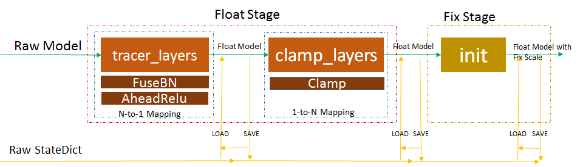
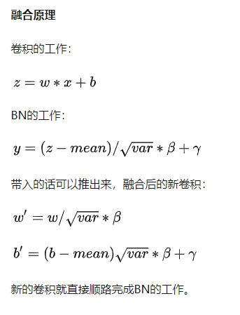

# 浮点-定点两阶段量化训练方案介绍


## RawMode
图中的RawMode可以是已经训练完成的浮点模型，也可以是随机初始化的模型。
- RawModel是已经训练完成的浮点模型：
  - 可以认为FloatStage 进行浮点数据调整，其中最重要的调整包括ConvBn融合，参数normalize和激活值normalize，这种调整有利于Fix Stage 的定点训练
  - 在实际使用中，由已训练的 raw model 直接进行FixStage 对定点损失比较严重，甚至loss直接崩溃

- RawModel是随机初始化的模型：
  - 可以认为FloatStage 的策略会直接参与训练，包括对weight和激活的normalize策略，以及ConvBn融合
  - 此处要注意ConvBN融合，并非简单直接将BN参数推入Conv，而是前向融合，反向不融合策略，获得最大的训练收益
  - 可能对训练效率有少许影响，经过几个案例的测试，我们发现影响大概在10%内

## RawStateDict
 图中RawStateDict加载是向后兼容的，兼容顺序可以箭头方向
 - 在模型变换的每个节点（图中FloatModel和FloatModelWithFixScale），都可以进行对StateDict加载和保存
 - 同一训练节点Save的StateDict可以被本节点Model加载(Save到Load的左向箭头)
 - 可以被后续阶段的节点加载
 - 在每个阶段可以导出onnx
 - 注意： 模型加载需要在网络变换的最后加载，中间不允许加载模型，如下代码示意
    ``` python
    model=MyNet()
    model=linger.trace_layers(....)
    model.load_state_dict(...) #it's OK    
    ```
    ``` python
    model=MyNet()
    model=linger.trace_layers(model,....)
    #model.load_state_dict(...) #it's NOT OK  
    model=linger.normalize_layers(model,....)
    model.load_state_dict(...) #it's OK 
    ```
    ``` python
    model=MyNet()
    model=linger.trace_layers(model,....)
    #model.load_state_dict(...) #it's NOT OK  
    model=linger.normalize_layers(model,....)
    #model.load_state_dict(...) #it's NOT OK 
    model=linger.init(model,...)
    model.load_state_dict(...) #it's OK
    ```

  
# layers 相关策略
## ConvBn融合原理介绍


linger 浮点阶段实现了convbn融合，执行保守融合策略

使用实例如下

``` python
class Model(nn.Module):
    def __init__(self):
        super(Model, self).__init__()
        self.transpose = nn.ConvTranspose2d(10, 10, 5, 5, 2, 4, 2, True, 2)
        self.conv = nn.Conv2d(10, 10, kernel_size=3, stride=1,
                        padding=1, bias=True, groups=2)
        self.bn = nn.BatchNorm2d(10)
        self.fc = nn.Linear(10*254*254, 100)

    def forward(self, x):
        x = self.transpose(x)
        x = self.conv(x)
        x = self.bn(x)
        n, c, h, w = x.shape
        x = x.view(n, c*h*w)
        x = self.fc(x)
        return x

model = Model()
print(model)
```

```
 Model(
  (transpose): ConvTranspose2d(10, 10, kernel_size=(5, 5), stride=(5, 5), padding=(2, 2), dilation=(2, 2), output_padding=(4, 4), groups=2)
  (conv): Conv2d(10, 10, kernel_size=(3, 3), stride=(1, 1), padding=(1, 1), groups=2)
  (bn): BatchNorm2d(10, eps=1e-05, momentum=0.1, affine=True, track_running_stats=True)
  (fc): Linear(in_features=645160, out_features=100, bias=True)
)
```
``` python
dummy_input = torch.randn(1, 10, 10, 10).cuda()
linger.trace_layers(model, model, dummy_input, fuse_bn=True)
print(model)
```
```
Model(
  (transpose): ConvTranspose2d(10, 10, kernel_size=(5, 5), stride=(5, 5), padding=(2, 2), dilation=(2, 2), output_padding=(4, 4), groups=2)
  (conv): NormalizeConvBN2d(
    normalize_data:None,normalize_weight:None,normalize_bias:None,ahead_relu:False
    (conv): Conv2d(10, 10, kernel_size=(3, 3), stride=(1, 1), padding=(1, 1), groups=2)
    (bn): BatchNorm2d(10, eps=1e-05, momentum=0.1, affine=True, track_running_stats=True)
  )
  (bn): EmptyBatchNorm()
  (fc): Linear(in_features=645160, out_features=100, bias=True)
)
```
从两次的输出的net网络可以看出，lingerCONVBN融合策略会将原网络的bn替换成`EmptyBatchNorm`，将原来的conv替换成`NormalizeConvBN2d`。

- EmptyBatchNorm ： 什么都没做，仅仅占位
- NormalizeConvBN2d : 带有normalize能力的convbn2d模块(此处normalize为None，不设置normalize功能)

## AHEAD_RELU
众所周知，Relu 操作是将负值用零替换。但如果Relu前面的操作OPX输出的量化，对正负值有一定的偏向性，特别是在负向有较大幅值，非常不利于输OPX的量化。由于OPX后紧跟Relu，因此可以使用OPX量化时可以仅仅关注正值量化，此策略即为AHEAD_RELU。
例如如下网络定义
``` python
class Model(nn.Module):
    def __init__(self):
        super(Model, self).__init__()
        self.conv = nn.Conv2d(10, 10, kernel_size=3, stride=1,
                        padding=1, bias=True)
        self.bn = nn.BatchNorm2d(10)
        self.relu = nn.ReLU()
        self.conv1 = nn.Conv2d(10, 10, kernel_size=3, stride=1,
                        padding=1, bias=True)
        self.relu1 = nn.ReLU()
        self.conv2 = nn.Conv2d(10, 10, kernel_size=3, stride=1,
                        padding=1, bias=True)  
        self.bn1 = nn.BatchNorm2d(10)
        self.relu2 = nn.ReLU()           
        self.fc = nn.Linear(250, 100)

    def forward(self, x):
        x = self.conv(x)
        x = self.bn(x)
        x = self.relu(x)
        x = x - 1
        x = self.conv1(x)
        x = self.relu1(x)
        x = self.conv2(x)
        x = self.bn1(x)
        x = self.relu2(x)
        n, c, h, w = x.shape
        x = x.view((n, c*h*w))
        x = self.fc(x)
        return x
```

其中 `self.bn`, `self.conv1`, `self.b1`都可以仅仅关注正方向的量化。

当前支持的组合策略包括 `ahead_conv_relu,ahead_bn_relu,ahead_linear_relu`
在trace_layers接口中均有选项，用户可以选用
`trace_layers(root_model,target_model,args,*,fuse_bn:bool =True,ahead_conv_relu:bool =True,ahead_bn_relu:bool =True,ahead_linear_relu:bool =True)`

注意：
- 虽然trace_layers ahead relu是属于浮点(预)训练阶段,但仅仅为配置选项，真正使用和产生影响是在量化训练阶段，即init之后
- trace_layers接口需要在init之前调用，同时只能执行一次，目前不允许网络trace多个部分, 建议放在所有配置操作的最前面